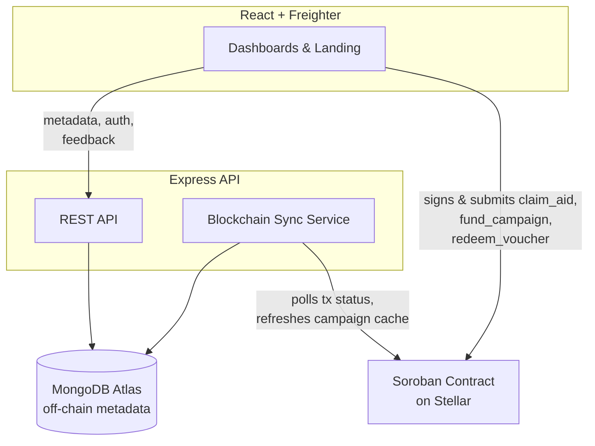

# ReliefLock

**Programmable humanitarian aid & voucher distribution on Stellar.**

NGOs create aid campaigns with on-chain enforced rules — allocation per
beneficiary, claim windows, claim limits, optional merchant-only
redemption. Beneficiaries claim aid directly to their Stellar wallet, or
redeem merchant vouchers, without a centralized administrator manually
approving every payment. The Soroban smart contract, not the backend, is
the source of truth for funding, eligibility, and distribution state.

## Status of this build — read this first

This repository was scaffolded by an AI assistant in a sandbox with **no
network access to the Rust toolchain**. Here's exactly what is and isn't
verified:

| Part | Status |
|---|---|
| Smart contract (`contracts/`) | Written against soroban-sdk 21.x. **Not compiled or tested** — needs `cargo test` run in an environment with Rust/wasm32 installed. |
| Backend (`backend/`) | ✅ Compiles clean (`tsc`), full build verified. Not run against a live MongoDB instance. |
| Frontend (`frontend/`) | ✅ Type-checks and builds clean (`vite build`), verified end to end. Contract calls are wired but untestable without a deployed `CONTRACT_ID`. |
| Deployment | Not deployed. No testnet contract address, no live URL, no real users onboarded. |
| Analytics / monitoring | PostHog and Sentry are wired as optional env vars in the backend; **no PostHog integration exists yet** — treat this as a TODO, not done. |

Before you submit this for the hackathon, you need to:

1. Run `cargo test` on the contract (Claude Code, or your machine) and fix
   any real compiler errors that surface — soroban-sdk point releases
   rename APIs often, so treat this as likely rather than unlikely.
2. Deploy the contract to Stellar Testnet and put the contract ID in both
   `backend/.env` and `frontend/.env`.
3. Stand up MongoDB Atlas, set `MONGODB_URI`, and deploy the backend
   (Render) and frontend (Vercel).
4. Add PostHog (analytics) and confirm Sentry (monitoring) actually fire
   in the deployed app — Level 4 requires screenshots of both working.
5. Onboard 10 real testnet users and collect genuine wallet-interaction
   evidence and feedback — this cannot be fabricated by an AI on your
   behalf, and judges are explicitly checking for it.

## Architecture



**On-chain (Soroban):** campaign funding, allocation, eligibility state,
claim state, voucher state, merchant authorization, distribution totals.

**Off-chain (MongoDB via backend):** names, documents, campaign
descriptions/images, feedback, transaction status cache for UI
responsiveness. The backend never signs or submits state-changing
transactions — every claim, fund, or redemption is signed client-side by
the user's own wallet and submitted directly to Soroban RPC.

## Repository layout

```
contracts/relieflock-contract/   Soroban smart contract (Rust)
backend/                          Express + TypeScript API, MongoDB
frontend/                         React + Vite + TypeScript + Tailwind
.github/workflows/ci.yml          CI: contract tests, backend/frontend builds
```

## Local development

### 1. Smart contract
```bash
cd contracts/relieflock-contract
rustup target add wasm32-unknown-unknown
cargo test
cargo build --target wasm32-unknown-unknown --release
```
See `contracts/relieflock-contract/README.md` for deployment steps.

### 2. Backend
```bash
cd backend
cp .env.example .env   # fill in MONGODB_URI, JWT_SECRET at minimum
npm install
npm run dev             # http://localhost:4000
```

### 3. Frontend
```bash
cd frontend
cp .env.example .env    # set VITE_CONTRACT_ID once deployed
npm install
npm run dev              # http://localhost:5173
```

## Security model

- Every state-changing contract call requires `require_auth()` from the
  acting party, and the contract re-checks ownership (e.g. that the caller
  is the campaign's NGO) rather than trusting the frontend.
- Checked arithmetic throughout — no silent overflow on fund amounts.
- A platform-admin-only `emergency_pause` halts all state changes contract-
  wide without giving the admin custody of user funds.
- Personal data (names, phone numbers, documents) never touches the chain.

## Known limitations (MVP scope)

- No dedicated on-chain event indexer — the sync service polls
  `getTransaction` rather than streaming `getEvents`, which is adequate at
  hackathon scale but not production scale.
- No fiat on/off ramp, multi-currency support, or offline beneficiary
  onboarding — these are explicitly out of scope for a testnet MVP per the
  Level 4 brief.
- Contract has point lookups (`get_campaign`, `get_voucher`) but no
  built-in "list all campaigns" — that's intentionally the backend cache's
  job, to avoid unbounded on-chain storage reads.

## Mainnet vision

Stablecoin settlement via regulated Stellar anchors, verified-NGO
onboarding, a merchant network with QR-based voucher redemption, and
disaster-response integrations with existing humanitarian data systems.
