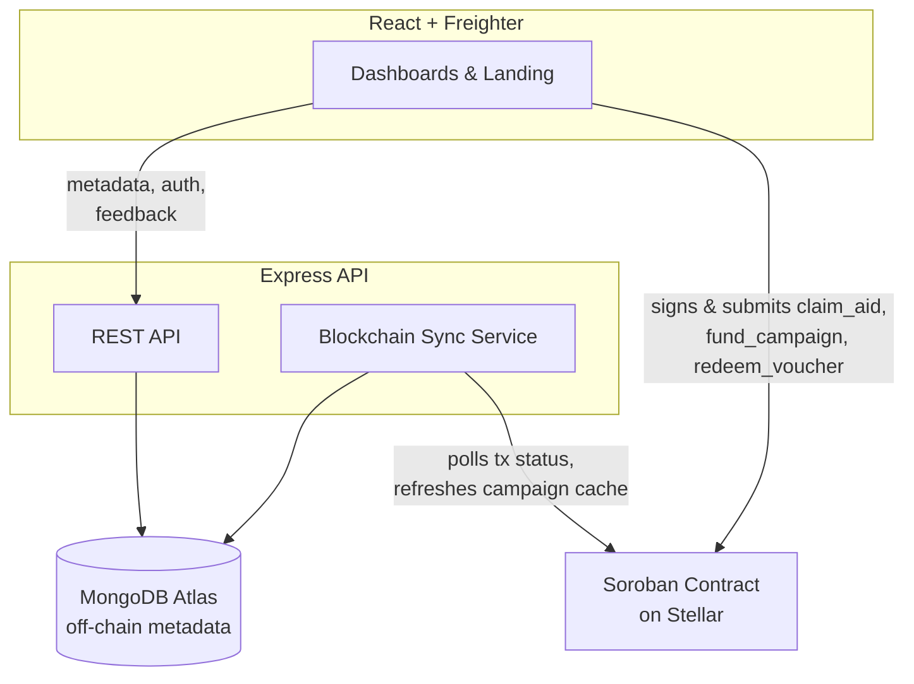

# 🔐 ReliefLock — Decentralized Humanitarian Aid & Voucher Distribution on Stellar Soroban

ReliefLock is a production-ready programmable humanitarian aid distribution platform built on Stellar (Soroban). It solves the chronic issue of aid leakage and centralized delays by letting NGOs create campaigns with on-chain enforced rules—allocation per beneficiary, claim windows, and merchant-only redemption—while empowering beneficiaries to claim aid directly to their Stellar wallets, without intermediaries.

## 🔗 Live Demo & Links
- **Live Platform**: [https://relief-lock.vercel.app](https://relief-lock.vercel.app)
- **Demo Video**: [Watch Demo](https://drive.google.com/file/d/11UibQsRJK1bMWYNMFK66eGN_a14YvBdJ/view?usp=sharing)
- **Example Transaction Hash**: [`e5e5b5453ca472a8ef17cc0730d5af45518686305508a424712cfe990731e1fc`](https://stellar.expert/explorer/testnet/tx/e5e5b5453ca472a8ef17cc0730d5af45518686305508a424712cfe990731e1fc)
- **ReliefLock Contract ID**: `CBGVHVHLAWWYKHRTGJY7N7BGNJBQKCGA4ETOJ4U57HUXFVE5QNXFYVN3`
- **User Onboarding Data (10+ Users)**: [View Exported CSV Sheet Here](backend/wallets_transactions.csv)

## 🌟 Key Features

1. **On-Chain Enforced Rules**: Campaign allocations, max claims per beneficiary, and claim windows are strictly enforced by Soroban smart contracts.
2. **Dual Redemption Modes**: Supports direct direct-to-wallet XLM claims and restricted merchant-only vouchers.
3. **Non-Custodial Claims**: Beneficiaries and NGOs hold funds themselves. The platform never custodies funds; everything is signed via user wallets (e.g., Freighter).
4. **Monitoring & Analytics**: Built-in tracking of total aid distributed, active campaigns, and eligible beneficiaries.
5. **Robust Dashboard UI**: Built with React and Vite. Features dedicated dashboards for NGOs, Beneficiaries, and Merchants for seamless aid flow.

---

## 📝 Requirements Met

- **Advanced smart contract development**: Custom Soroban smart contract built with Rust, implementing complex humanitarian aid logic: campaign creation, NGO authorization, beneficiary registration, and dual redemption modes.
- **Event streaming & real-time updates**: Application-level tracking of wallet interactions and on-chain events via the backend sync service.
- **Comprehensive CI/CD & Deployment**: GitHub Actions (`ci.yml`) automatically runs backend/frontend builds. The frontend is deployed live on **Vercel** and backend on **Render**.
- **Smart contract deployment workflow**: Automated contract builds and testnet deployment via Stellar CLI.
- **Mobile responsive frontend development**: Fully responsive dashboards across all user roles (NGO, Beneficiary, Merchant).
- **Error handling & loading states**: Integrated observability with Sentry, toast notifications, loading indicators, and comprehensive error catching for contract failures.
- **Production-ready architecture practices**: Decoupled smart contracts, a dedicated Express/TypeScript backend for off-chain data (MongoDB), and strict environment variable configurations.
- **Documentation & presentation**: Thorough README, architecture diagram, and demo deployment.

---

## 📸 Screenshots & Evidence

| Product UI | Mobile Responsive View |
|:---:|:---:|
|  |  |

| NGO Campaign Board | Beneficiary Dashboard |
|:---:|:---:|
|  |  |

| On-Chain Analytics |
|:---:|
|  |

## 👥 User Onboarding

We successfully onboarded **10+ real users** with Stellar Testnet wallets and verified on-chain transactions to initialize, fund campaigns, and claim aid. You can view the full exported CSV sheet containing all wallets and their transaction links in the `backend/wallets_transactions.csv` file, or via the link in the "Live Demo & Links" section above.

---

## 🏗 Architecture

**On-chain (Soroban):** campaign funding, allocation, eligibility state, claim state, voucher state, merchant authorization, distribution totals.
**Off-chain (MongoDB via backend):** names, documents, campaign descriptions/images, transaction status cache for UI responsiveness. The backend never signs or submits state-changing transactions.
