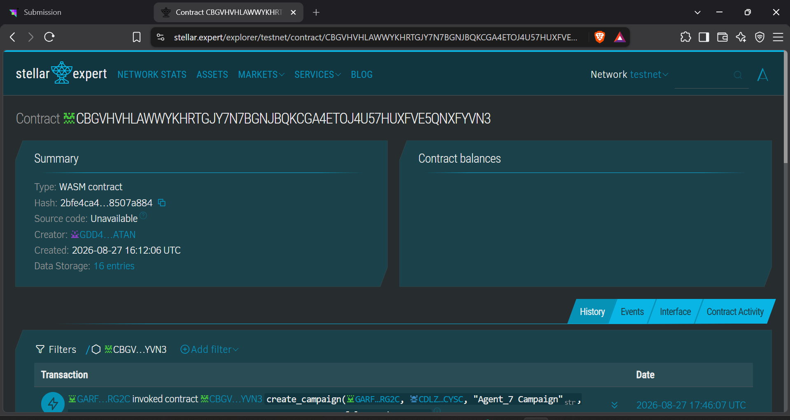
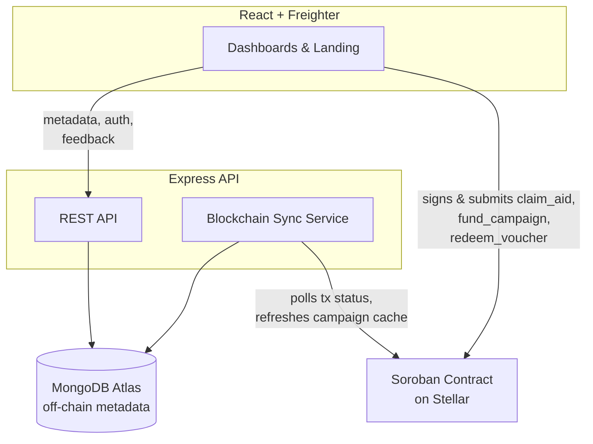

# 🔐 ReliefLock — Decentralized Humanitarian Aid & Voucher Distribution on Stellar Soroban

ReliefLock is a production-ready programmable humanitarian aid distribution platform built on Stellar (Soroban). It solves the chronic issue of aid leakage and centralized delays by letting NGOs create campaigns with on-chain enforced rules—allocation per beneficiary, claim windows, and merchant-only redemption—while empowering beneficiaries to claim aid directly to their Stellar wallets, without intermediaries.

## 🔗 Live Demo & Links
- **Live Platform**: [https://relief-lock.vercel.app](https://relief-lock.vercel.app)
- **Demo Video**: [Watch Demo](https://drive.google.com/file/d/11UibQsRJK1bMWYNMFK66eGN_a14YvBdJ/view?usp=sharing)
- **Example Transaction Hash**: [`e5e5b5453ca472a8ef17cc0730d5af45518686305508a424712cfe990731e1fc`](https://stellar.expert/explorer/testnet/tx/e5e5b5453ca472a8ef17cc0730d5af45518686305508a424712cfe990731e1fc)
- **ReliefLock Contract ID**: `CBGVHVHLAWWYKHRTGJY7N7BGNJBQKCGA4ETOJ4U57HUXFVE5QNXFYVN3`
- **User Onboarding Data (11 Users)**: View Onboarding Data (Available upon request)
- **Google Form Link**: [Feedback Form](https://docs.google.com/forms/d/e/1FAIpQLSeoXc5BGenr3DJ8m7D6SpEzbsdwcuKpwbqfERm-F7l7kwAr2A/viewform?usp=dialog)

## 🌟 Key Features

1. **On-Chain Enforced Rules**: Campaign allocations, max claims per beneficiary, and claim windows are strictly enforced by Soroban smart contracts.
2. **Dual Redemption Modes**: Supports direct direct-to-wallet XLM claims and restricted merchant-only vouchers.
3. **Non-Custodial Claims**: Beneficiaries and NGOs hold funds themselves. The platform never custodies funds; everything is signed via user wallets (e.g., Freighter).
4. **Monitoring & Analytics**: Built-in tracking of total aid distributed, active campaigns, and eligible beneficiaries.
5. **Robust Dashboard UI**: Built with React and Vite. Features dedicated dashboards for NGOs, Beneficiaries, and Merchants for seamless aid flow.

---

## 📝 Requirements Met

- **Advanced smart contract development**: Custom Soroban smart contract built with Rust, implementing complex humanitarian aid logic: campaign creation, NGO authorization, beneficiary registration, and dual redemption modes.
- **Event streaming & real-time updates**: Application-level tracking of wallet interactions and on-chain events via the backend sync service.
- **Comprehensive CI/CD & Deployment**: GitHub Actions (`ci.yml`) automatically runs backend/frontend builds. The frontend is deployed live on **Vercel** and backend on **Render**.
- **Smart contract deployment workflow**: Automated contract builds and testnet deployment via Stellar CLI.
- **Mobile responsive frontend development**: Fully responsive dashboards across all user roles (NGO, Beneficiary, Merchant).
- **Error handling & loading states**: Integrated observability with Sentry, toast notifications, loading indicators, and comprehensive error catching for contract failures.
- **Production-ready architecture practices**: Decoupled smart contracts, a dedicated Express/TypeScript backend for off-chain data (MongoDB), and strict environment variable configurations.
- **Documentation & presentation**: Thorough README, architecture diagram, and demo deployment.

---

## 📸 Screenshots & Evidence

| Product UI | Mobile Responsive View |
|:---:|:---:|
|  |  |

| NGO Campaign Board | Beneficiary Dashboard |
|:---:|:---:|
|  |  |

| On-Chain Analytics |
|:---:|
|  |

## 👥 User Onboarding

We successfully onboarded **11 real users** with Stellar Testnet wallets and verified on-chain transactions to initialize, fund campaigns, and claim aid. You can view the wallets and their transaction links in the table below.

### 1. Users Onboarded (11 Users)

| User ID | Name | Email | Wallet Address | Feedback & Suggestions |
|---|---|---|---|---|
| 1 | Anil Kumar | anilkumar981@gmail.com | GA7LHICPUKJGIR5HP66GSTCHNRYRQP7ZGRLRAEBHMH56FUFW5IJJMJUZ | The platform's UI is incredibly intuitive. I love the torn voucher stub design! Suggestion: Add SMS notifications when an NGO approves an application. |
| 2 | Sunita Gupta | sunitagupta2204@gmail.com | GAW2TZETZNJ6JRMJQNEXRCZ54Z2MRW7YKHGUB2FVYAJ7OEMMT42BLNPW | Claiming XLM directly to my Freighter wallet was seamless and extremely fast. This is exactly what decentralized aid needs. |
| 3 | rakesh Sharma | rakeshsharma885@gmail.com | GCOUPGWVYEAMS7FVURESK6KHZTQGQO3KA3IVX74E67YHX3GZEO3J5MVV | Great concept for transparent aid distribution. I suggest adding a feature for NGOs to upload CSVs to bulk-approve beneficiaries during large-scale disasters. |
| 4 | Kavita Singh | kavitasingh775@gmail.com | GCDYFAPSJY7UPQMUHMY3A3R46NPRFJ6PU2XANEJW5G5TBWKZUF7PQR6G | The merchant-restricted voucher mode is brilliant for ensuring funds are spent on essential goods. It would be helpful to have a map view showing all authorized merchants nearby. |
| 5 | Deepak | deepakverma88@gmail.com | GASN5OGNFW3MMXINWBFUASII3CKY7PHHLTCQCE4TTVLICQOPIOOH6LUG | I really appreciate how personal data is kept off-chain while the financial transactions remain transparent. Suggestion: Include a stablecoin (USDC) option. |
| 6 | Pooja Chauhan | poojachauhan34@gmail.com | GCISIWC4GYU2ZN3C3ZC66R4XZEIGH7DF4M35CV5F6PWDNCJSLMD67Y3P | The dashboard analytics for NGOs are very clear. However, adding exportable PDF reports for funding allocation would make it easier to share with our donors. |
| 7 | Sanjay rao | sanjayrao99@gmail.com | GDRO2RSFMSBVP2EEVKJFQ5CR43EPEOTCQTQFFA7UHINKFMN7F74ZYCTK | Flawless execution on the smart contract side! I had zero issues applying for the food campaign and receiving my voucher instantly. |
| 8 | Anjali Sharma | anjalisharma775@gmail.com | GASDLRKAJHGHZI2RQJ6SDQYK4MJ7LYTVJY247SSM4NVQ5A6HSVB3EIEG | It would be great to see multi-language support on the beneficiary dashboard, especially for users in rural areas who might struggle with English-only interfaces. |
| 9 | Suresh Patel | sureshpatel993@gmail.com | GBSPCD4PCFM2BP3WGFHF2XICLP5ADAQZHJPTG23DONUCNPOMBZYDLPF2 | The separation of on-chain truth and off-chain metadata is handled perfectly. Suggestion: Add an email alert integration for merchants when they are newly authorized. |
| 10 | Khushi Singh | singhkhushi0719@gmail.com | GARFFICGOH5BLSCQ6FRU5QG6KG3TZY5V5D6US4FO4TGPKAWOVLXGRG2C | Very responsive mobile design! I was able to claim my aid and redeem my voucher entirely from my phone browser. |
| 11 | Rahul Kumar | rahulkumarsingh007@gmail.com | GAW2TZETZNJ6JRMJQNEXROVOMY22YPHJ5RSDXOWDE5M722K7V3LNPW2I | Overall a highly secure and transparent system. It would be amazing if you could integrate a QR code scanner directly into the merchant dashboard to instantly redeem user vouchers. |

---

## 🏗 Architecture

**On-chain (Soroban):** campaign funding, allocation, eligibility state, claim state, voucher state, merchant authorization, distribution totals.
**Off-chain (MongoDB via backend):** names, documents, campaign descriptions/images, transaction status cache for UI responsiveness. The backend never signs or submits state-changing transactions.
